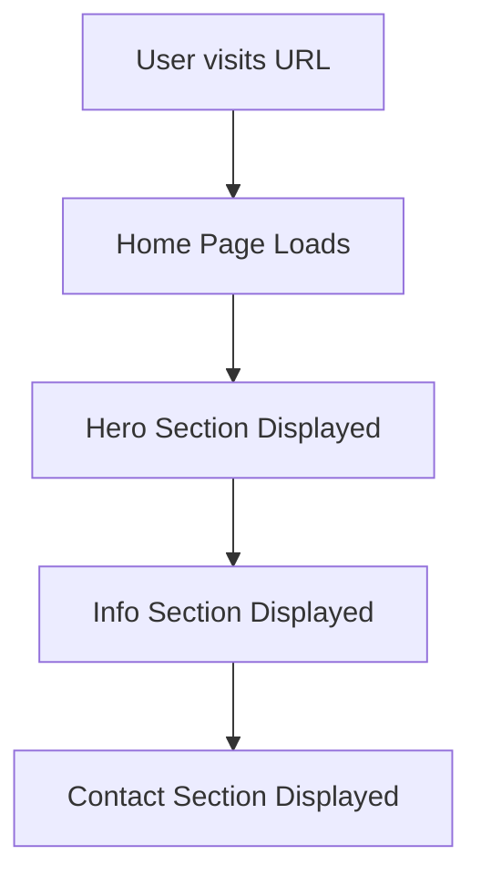

## 1. Product Overview
A simple one-page test website designed for quick deployment and GitHub hosting. This minimal website serves as a demonstration piece for testing deployment workflows and showcasing basic web presence capabilities.

The target users are developers who need a quick test website for deployment practice or portfolio demonstration purposes.

## 2. Core Features

### 2.1 User Roles
No user authentication or role differentiation required for this simple test website.

### 2.2 Feature Module
Our simple test website consists of the following main page:
1. **Home page**: hero section, basic information display, contact section.

### 2.3 Page Details
| Page Name | Module Name | Feature description |
|-----------|-------------|---------------------|
| Home page | Hero section | Display welcome message with animated text and background |
| Home page | Info section | Show basic website information and purpose |
| Home page | Contact section | Display contact information and social links |

## 3. Core Process
Users access the website through the deployed URL. The single-page design provides all information in a scrollable format without navigation complexity.

## 4. User Interface Design

### 4.1 Design Style
- Primary color: #2563eb (blue)
- Secondary color: #1f2937 (dark gray)
- Button style: Rounded corners with hover effects
- Font: System fonts (Inter, sans-serif)
- Layout style: Single-page scroll with sections
- Icon style: Simple line icons or emojis

### 4.2 Page Design Overview
| Page Name | Module Name | UI Elements |
|-----------|-------------|-------------|
| Home page | Hero section | Full-width hero with gradient background, large welcome text, subtle animation |
| Home page | Info section | Clean card-based layout with concise text and icon elements |
| Home page | Contact section | Simple contact cards with social media icons and email link |

### 4.3 Responsiveness
Desktop-first design approach with mobile-responsive layout. The single-page design adapts to different screen sizes with flexible grid layouts and readable typography scaling.