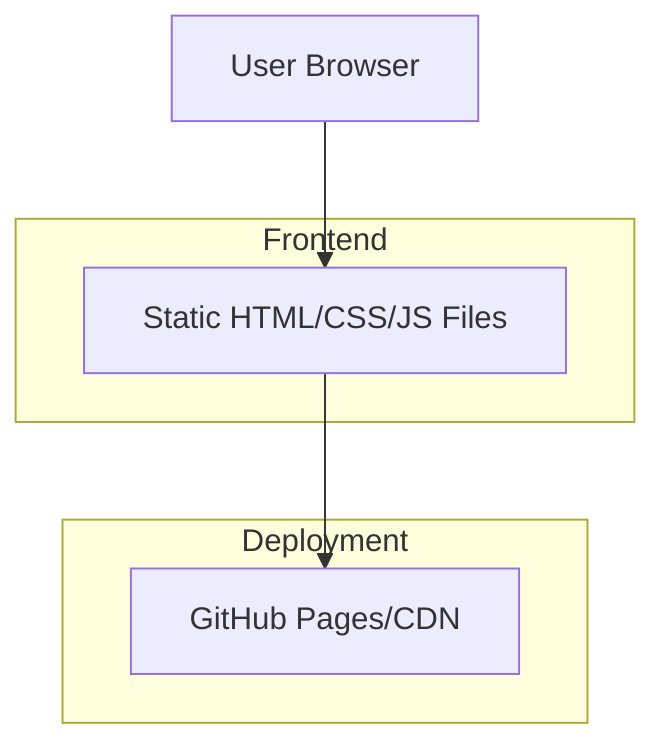

## 1. Architecture design


## 2. Technology Description
- Frontend: HTML5 + CSS3 + Vanilla JavaScript
- Initialization Tool: None (simple static files)
- Backend: None (static website)
- Deployment: GitHub Pages

## 3. Route definitions
| Route | Purpose |
|-------|---------|
| / | Home page, displays the complete single-page website |

## 4. File Structure
```
simple-test-website/
├── index.html          # Main HTML file
├── css/
│   └── styles.css      # Main stylesheet
├── js/
│   └── main.js         # JavaScript functionality
├── assets/
│   └── images/         # Optional images
└── README.md           # Project documentation
```

## 5. Deployment Configuration
GitHub Pages deployment settings:
- Source: Deploy from a branch
- Branch: main
- Folder: / (root)

## 6. Performance Considerations
- Minimal dependencies for fast loading
- Optimized images (if used)
- CSS and JS minification recommended for production
- Mobile-first responsive design